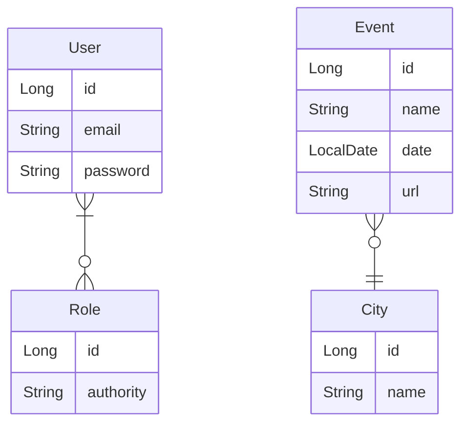

# DESAFIO VALIDAÇÃO E SEGURANÇA
📍 DEVSUPERIOR / SPRING EXPERT / CHALLENGES  
📅 October 30, 2023 - 🚩 São Paulo, Brazil - 😁 Mauricio Mityo Hidani  

Implemente as funcionalidades necessárias para que os testes do projeto abaixo 
passem:

**Cidade:**
- Inserrir
  - Deve retornar 401 quando não houver usuário logado
  - Deve retornar 403 quando usuário logado for CLIENT
  - Deve inserir corretamente os dados quando for um ADMIN logado
  - Deve retornar 422 quando o NOME da cidade estiver em branco e o usuário for 
    ADMIN
- Encontrar Todos
  - Deve retornar resultado ordenado por NOME em ordem CRESCENTE

**Evento:**
- Inserir
  - Deve retornar 401 quando não houver usuário logado
  - Deve inserir corretamente os dados quando for um CLIENT logado
  - Deve inserir corretamente os dados quando for um ADMIN logado
  - Deve retornar 422 quando o NOME do evento estiver em branco e o usuário for 
    ADMIN
  - Deve retornar 422 quando o DATA do evento já ocorreu e o usuário for ADMIN
  - Deve retornar 422 quando a CIDADE for nula e o usuário for ADMIN
- Encontrar Todos
  - Deve retornar os eventos como resultado PAGINADO

Este é um sistema de eventos e cidades com uma relação N-1 entre eles:

**Regras de controle de acesso:**
- Somente rotas de leitura (GET) de eventos e cidades são `públicas` (não requer login).
- Usuários `CLIENT` e/ou `ADMIN` podem inserir novos eventos (POST).
- Os demais acessos são permitidos apenas a usuários `ADMIN`.

**Regras de validação de City:**
- Nome não pode ser vazio

**Regras de validação de Event:**
- Nome não pode ser vazio
- Data não pode ser passada
- Cidade não pode ser nula
